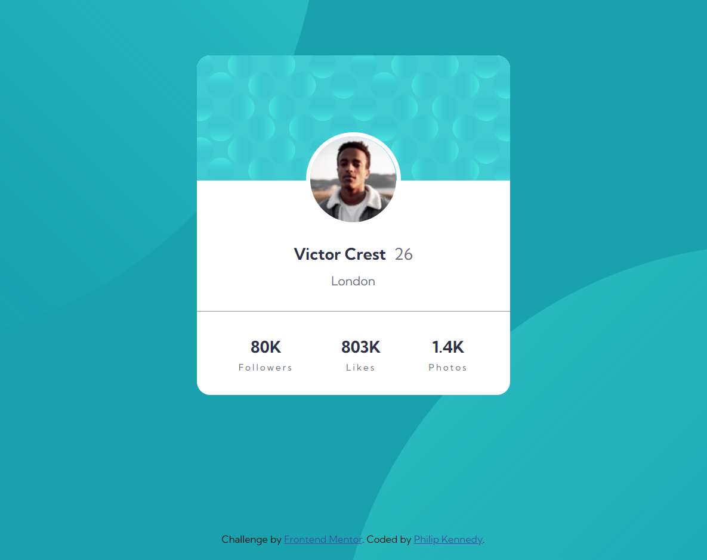

# Frontend Mentor - Profile Card Component

This is my solution for the [Profile Card Component](https://www.frontendmentor.io/challenges/profile-card-component-cfArpWshJ) (Newbie Challenge) on Frontend Mentor.

## Table of Contents

- [Overview](#overview)
  - [The Challenge](#the-challenge)
  - [Screenshot](#screenshot)
  - [Links](#links)
- [My Process](#my-process)
  - [Built with](#built-with)
  - [What I Learned](#what-i-learned)
  - [Useful Resources](#useful-resources)
- [Author](#author)

## Overview

### The Challenge

- **Difficulty -** `Newbie`

The challenge is to build out this Profile Card Component and get it looking as close to the design as possible.

### Screenshot

### Links

- **Solution URL -** [Frontend Mentor Solution](https://www.frontendmentor.io/solutions/profile-card-component-w2nQu5-F3z)

- **Live Site URL -** [Live Site Preview (Vercel)](https://profile-card-component-phlpknndy.vercel.app/)

## My Process

### Built with

- Semantic HTML5 markup
- CSS custom properties

### What I Learned

How to apply multiple background images simultaneously and set their initial position.

### Useful Resources

- [background-image](https://developer.mozilla.org/en-US/docs/Web/CSS/background-image) **-** Useful reference for the background-image CSS property.

- [background-position](https://developer.mozilla.org/en-US/docs/Web/CSS/background-position) **-** Useful reference for the background-position CSS property.

## Author

- **Github -** [PhlpKnndy](https://github.com/PhlpKnndy)
- **Frontend Mentor -** [PhlpKnndy](https://www.frontendmentor.io/profile/PhlpKnndy)
